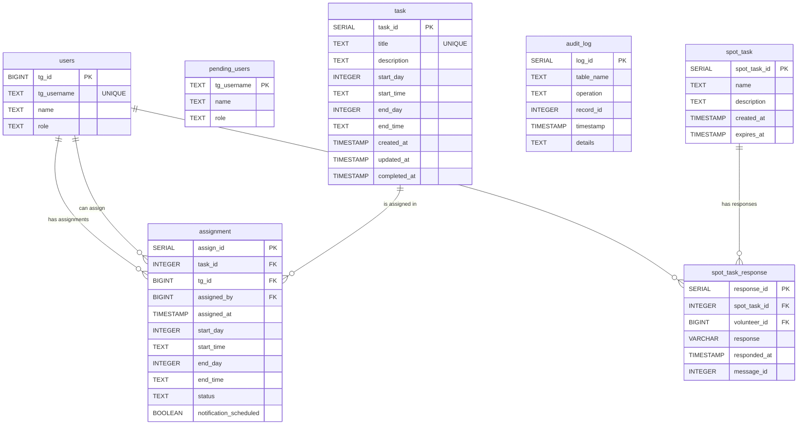

# MB-bots-volunteer
Таск менджмент для волонтеров конференции Менеджмент Будущего 
## Основные функции
- **Добавление пользователей** по юзернейму телеграмма
- **Разделение на роли**: Админ и Волонтер 
- **Управление заданиями**: добавление, просмотр, редактирование, удаление 
- **Назначение волонтеров на задания**
- **Управление срочными заданиями**: создание, рассылка волонтерам, уведомления об ответе админу, ручное и автоматическое удаление (спустя время, по умолчанию 30 минут) 
- **Синхронизация с Google Sheets**: ручная синхронизация в обе стороны БД<->Google Sheets. Задания, назначения и волонтеры отдельно. 
- **Уведомления волонтерам** 

## Структура БД

